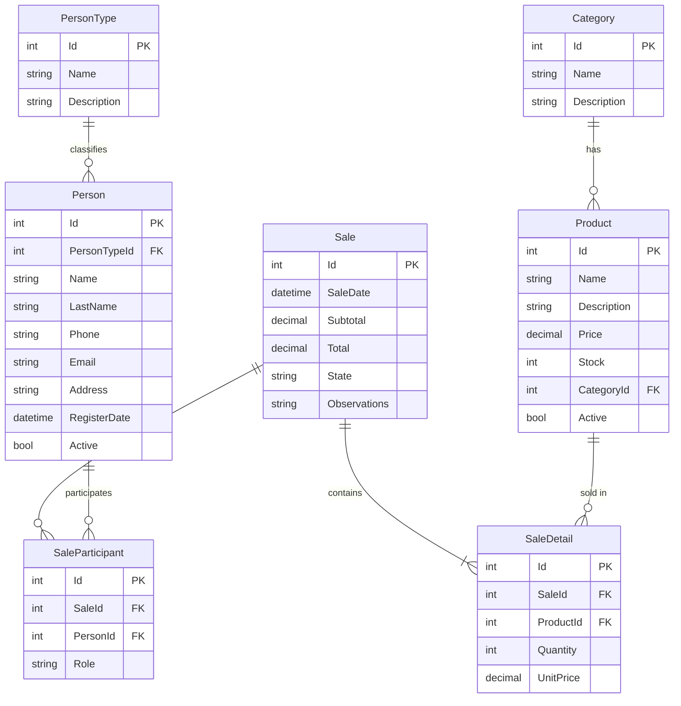

```mermaid
erDiagram
    PersonType {
        int Id PK
        string Name
        string Description
    }

    Person {
        int Id PK
        int PersonTypeId FK
        string Name
        string LastName
        string Phone
        string Email
        string Address
        datetime RegisterDate
        bool Active
    }

    Category {
        int Id PK
        string Name
        string Description
    }

    Product {
        int Id PK
        string Name
        string Description
        decimal Price
        int Stock
        int CategoryId FK
        bool Active
    }

    Sale {
        int Id PK
        datetime SaleDate
        decimal Subtotal
        decimal Total
        string State
        string Observations
    }

    SaleParticipant {
        int Id PK
        int SaleId FK
        int PersonId FK
        string Role
    }

    SaleDetail {
        int Id PK
        int SaleId FK
        int ProductId FK
        int Quantity
        decimal UnitPrice
    }

    PersonType ||--o{ Person : "classifies"
    Category ||--o{ Product : "has"
    Sale ||--o{ SaleParticipant : "has participants"
    Person ||--o{ SaleParticipant : "participates"
    Sale ||--|{ SaleDetail : "contains"
    Product ||--o{ SaleDetail : "sold in"
```
