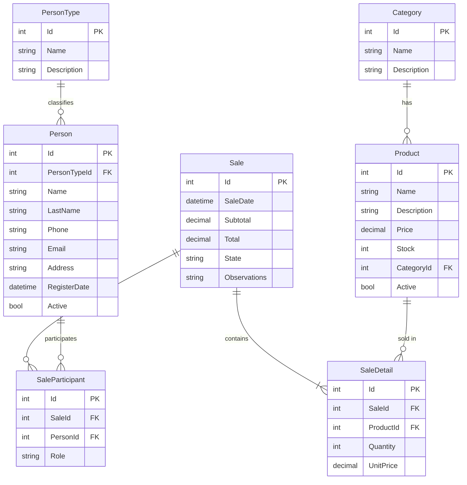

## Seed de datos

El seed se ejecuta automáticamente al iniciar la API si la base de datos está vacía.

### Cómo resetear y re-ejecutar el seed

```bash
# 1. Desde la carpeta Api/ (IMPORTANTE: correr siempre desde aquí)
cd Api

# 2. Eliminar la base de datos actual
rm app.db

# 3. Iniciar la API — aplica migrations y seed automáticamente
dotnet run
```

### Datos generados

| Tabla | Registros |
|-------|-----------|
| PersonType | 4 (Administrador, Vendedor, Cliente, Proveedor) |
| Category | 6 (Tortas, Panadería, Postres, Bocados, Tartas, Galletas) |
| Person | 5 — contraseña de todos: `Password123!` |
| Product | 16 distribuidos entre las 6 categorías |
| Sale | 6 (3 Completadas, 2 Pendientes, 1 Cancelada) |

### Credenciales de prueba

| Email | Contraseña | Rol |
|-------|------------|-----|
| maria@reposteria.com | Password123! | Administrador |
| juan@reposteria.com | Password123! | Vendedor |
| sofia@gmail.com | Password123! | Cliente |
